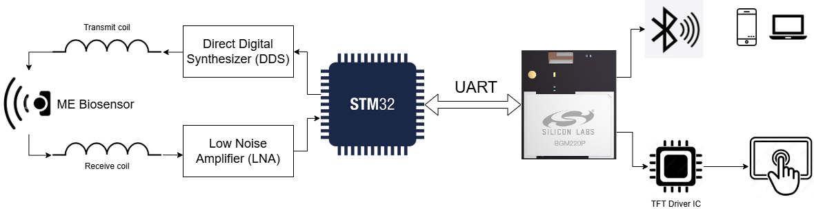

# Portable Wireless Interrogation System For Magnetoelastic Biosensors

This portable wireless interrogation system allows for the real-time detection and monitoring of Magnetoelastic sensors and uses the “Ringdown” method of detection using a Transmit side and a Receive side. The Ringdown Analysis method characterizes an ME sensor by looking at its vibration duration vs frequency of a time-varying magnetic field. 

The objectives of the code in this repo is to send BLE packets of the generated data over to a Bluetooth capable device to be viewed using a HTML webapp and graph the results obtained from the sensor readout system on a Touch Screen that has an interactive GUI to set/change system control parameters.

[Link to webapp](https://prasana-sys.github.io/Magnetoelastic_Biosensor_PWIS/)

## Parts Used
- Silicon Labs BGM220P Explorer Kit
- Adafruit RA8875 TFT Driver
- Adafruit 7" 800x480 Touch Screen

## System Design

The system is split into two parts, the STM32 and the BGM220P microcontroller side. They communicate over UART to send two different kinds of packets, ringdown data and ringdown parameters.

When the BGM220P boots, the BLE stack initializes a GATT database that includes a custom ME sensor service with data characteristics for sending sensor readings via indications and receiving the parameters to/from a cell phone or laptop using a HTML based app.

More info in doc/PWIS_Expo_Poster
